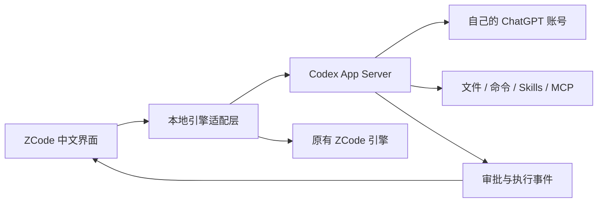

# Codex for ZCode

**在 ZCode 中文工作台里，用自己的 ChatGPT 订阅运行 Codex。**

[English](README.en.md) · [构建与使用](docs/QUICKSTART.md) · [路线图](docs/ROADMAP.md) · [反馈问题](https://github.com/kermars39-web/codex-for-zcode/issues)


[](https://github.com/kermars39-web/codex-for-zcode/actions/workflows/codex-checks.yml)

已经有 ChatGPT 订阅，也习惯了 ZCode 的中文界面和项目管理？这个项目把 **Codex App Server** 接到 ZCode：登录、任务、多轮续聊、文件修改、命令、审批和历史导入，在同一个工作台里完成。

这是基于 [Z.ai / ZCode](https://github.com/zai-org/ZCode) 的社区派生版本，保留原引擎。不是 OpenAI 或 Z.ai 官方产品，也不是往原版里安装的插件。

> **当前为桌面预览版。** 应用名称为 **Codex for ZCode**，与原版独立。Mac 已有本机订阅执行验证；Windows 完成原生构建、安装、启动和协议检查，真实订阅的完整执行与历史导入仍待外部测试。

## 下载

| 平台 | 安装包 |
|---|---|
| macOS Apple Silicon（M 系列） | [下载 ZIP](https://github.com/kermars39-web/codex-for-zcode/releases/download/v0.1.0-alpha.2/Codex-for-ZCode-0.1.0-alpha.2-macos-arm64.zip) |
| Windows x64（Intel / AMD） | [下载安装器 EXE](https://github.com/kermars39-web/codex-for-zcode/releases/download/v0.1.0-alpha.2/Codex-for-ZCode-0.1.0-alpha.2-windows-x64.exe) |

[发行说明与 SHA256 校验和](https://github.com/kermars39-web/codex-for-zcode/releases/tag/v0.1.0-alpha.2) · [安装与构建指南](docs/QUICKSTART.md)

Mac 包使用临时签名，尚未获得 Apple 公证；Windows 包暂未使用发行商代码签名。系统可能提示未知开发者，先核对来源与校验和，不需要关闭系统安全保护。

## 解决什么问题

| 你遇到的情况 | 这个项目提供什么 |
|---|---|
| 想沿用 ZCode 界面，又想使用 Codex | 本地接入 Codex 引擎，由它管理会话、执行和审批 |
| 已有 ChatGPT 订阅，不想另配 API Key | 使用自己的 Codex / ChatGPT 登录；本集成拒绝自动切到 API Key 计费 |
| Desktop 中已有上下文，换工具要重新讲一遍 | 预览并导入历史为独立副本；原生复制不支持时明确使用兼容续聊 |
| 想给模型起方便记忆的名称 | 可选显示别名；默认显示真实模型，实际请求 ID 不变 |

“国内工具”指这里使用的 ZCode 界面与工作流。**本项目不提供网络通道，不改变 OpenAI 的服务地区、模型权限或订阅额度**。需要用户自己的可用账号与服务访问条件。参见官方 [Codex 认证说明](https://learn.chatgpt.com/docs/auth) 和 [支持地区](https://help.openai.com/en/articles/7947663-chatgpt-supported-countries)。

## 它是怎么工作的



界面不接管认证令牌；Codex 管理自己的登录。额外权限请求显示在界面中，由用户处理；断线后不会自动重发可能已经执行的操作。App Server 能力以 [官方接口文档](https://learn.chatgpt.com/docs/app-server) 为准。

## 从源码构建

准备 **Apple Silicon Mac、Xcode Command Line Tools、Node 24.14.0、pnpm 10.33.2**。

```bash
# 安装已验证的运行时；使用自己的账号完成登录
npm install -g @openai/codex@0.155.1
codex login

git clone https://github.com/kermars39-web/codex-for-zcode.git
cd codex-for-zcode
pnpm install --frozen-lockfile
node scripts/build-codex-desktop.mjs
```

构建结果：`release-assets/` 中的安装包，以及 `packages/desktop/dist/mac-arm64/Codex for ZCode.app`。Windows x64 构建见快速开始。从 Finder 打开并创建一个测试项目；遇到系统限制时先核实来源和签名，不需要关闭系统安全保护。详细前置条件、运行时定位和常见问题见 [快速开始](docs/QUICKSTART.md)。

**第一条体验路径：** 新建任务 → 选择目录和真实模型 → 提出小任务 → 按需审批 → 查看修改。之后可以从侧栏“任务”菜单导入自己的 Desktop 历史。

## 当前能力与边界

- 流式回复、工具记录、命令输出、Diff、停止、恢复历史、运行中追加指令。
- 项目归组、草稿恢复、原版风格的输入框与文件预览。
- 历史导入去重、完成轮次边界、缺失附件提示、长历史分页展示。
- 原生复制与兼容续聊互相独立；兼容方式保留可见历史资料，不恢复隐藏运行状态。
- 公开版不锁定某个模型：以账号实际返回列表为准；可选别名不能获得其他模型能力。
- **未接入** Codex Desktop 专属浏览器/连接器、手机远控和远程 Codex。原版 SSH / Docker 入口存在不等于它们支持本集成。
- 首次加载超长历史仍需 Host 汇集分页，内存和加载时间会随历史增大。

## 开发与贡献

```bash
pnpm exec tsx --test tests/codex-engine/*.test.ts tests/codex-engine/*.test.mjs
pnpm typecheck
pnpm lint
pnpm architecture:check --changed
```

主要适配代码位于 `packages/services/src/codex-engine` 和 `packages/ui/src/codex`。提交问题请带系统、运行时版本和脱敏复现步骤；不要上传账号文件或真实会话。见 [贡献指南](CONTRIBUTING.md)、[安全说明](SECURITY.md) 和 [路线图](docs/ROADMAP.md)。

如果它帮你减少了在两套工作台之间切换的成本，欢迎 Star。更欢迎反馈一条可复现的问题，或贡献一个经过验证的平台支持。

## 上游与许可

基于 ZCode **3.14.0 / `872ad960de7ec172591f7e1952f7849229f94521`**，上游贡献与版权归原作者；本仓库明确列出 [修改范围](MODIFICATIONS.md)。原 [Apache-2.0](LICENSE)、[NOTICE](NOTICE.md) 和 [第三方声明](THIRD-PARTY-NOTICES.md) 保留。Codex 来自 [openai/codex](https://github.com/openai/codex)，运行时由构建者另行安装；仓库不包含账号、对话或 Codex 二进制。
